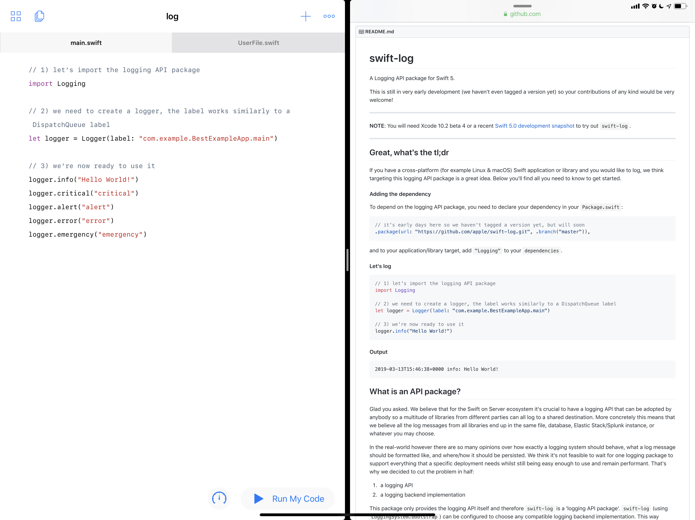

# swift-log-playgroundbook

This is a template of a Swift playground book that uses [swift-log](https://github.com/apple/swift-log) as a module. It requires Swift Playground 3.0 on iOS 12.2.

[swift-log](https://github.com/apple/swift-log) is licensed under Apache-2.0.
