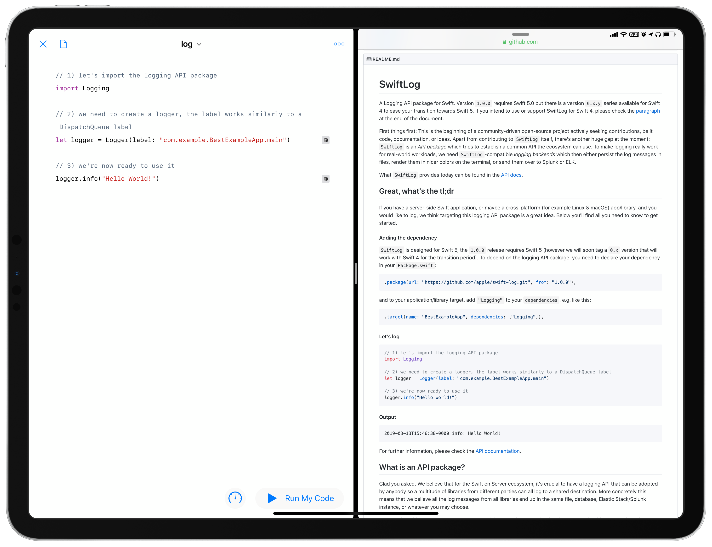

# swift-log-playgroundbook

This is a template of a Swift playground book that uses [swift-log](https://github.com/apple/swift-log) as a module. It requires Swift Playground 3.0 on iOS 12.2.

This repository contains the source code of [swift-log](https://github.com/apple/swift-log), which is licensed under Apache-2.0.
